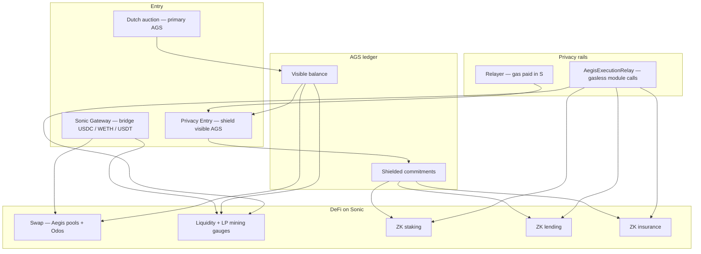
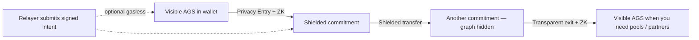
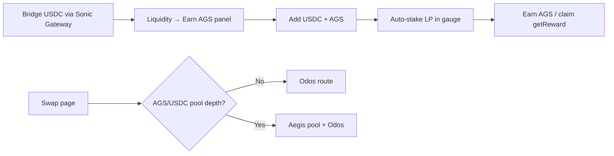
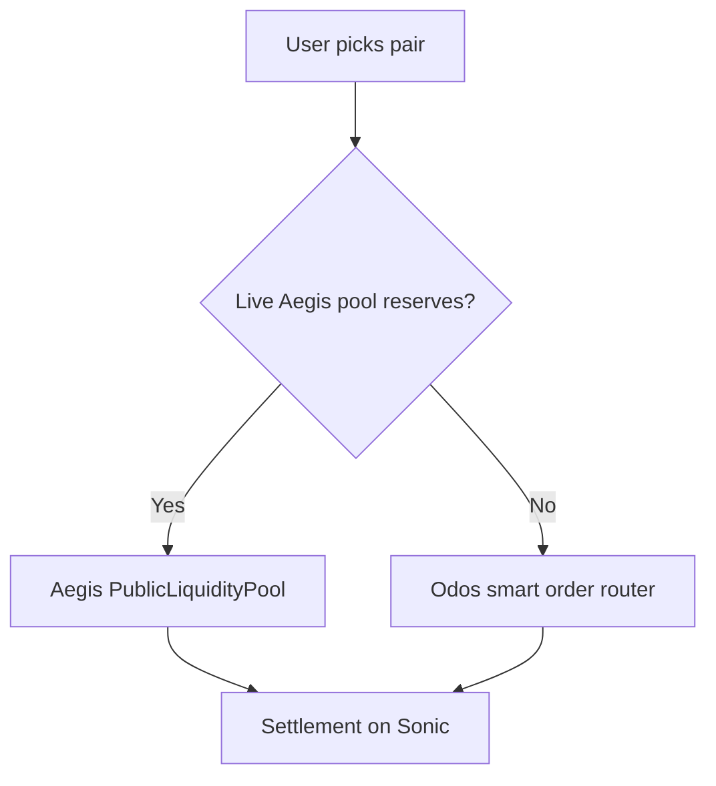
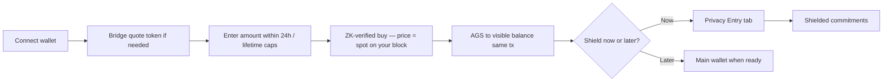
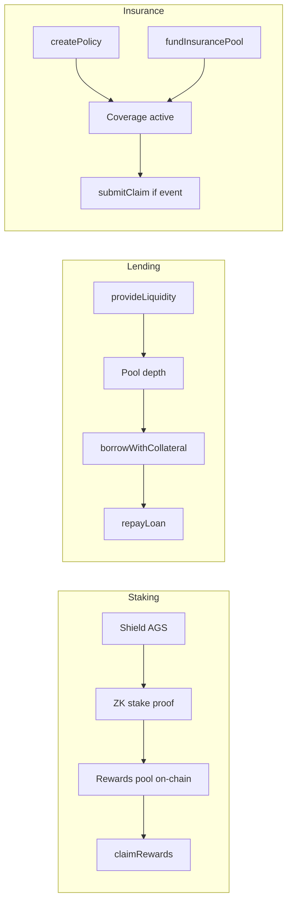
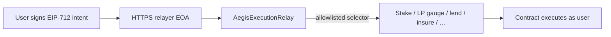

# Aegis

**Private finance, built to be used.**

---

## What we are

Aegis is a complete financial system on **Sonic** — trade, save, borrow, insure, vote, raise capital, and move money across chains — with **privacy built in**, not bolted on.

Most blockchains treat your wallet like a public profile. Every transfer becomes a story anyone can read, copy, and trade against. Aegis is built for people who want the opposite: **a real economy where your wealth and your choices stay yours.**

We are not a single app or a single feature. We are a **protocol and an ecosystem** — a full stack of products that share one idea: **participate in finance without performing your life on-chain.**

---

## The idea

Since the beginning, crypto promised money without middlemen. What it often delivered was money **with a permanent public record attached to your name.**

Aegis closes that gap.

We use **zero-knowledge cryptography** so the network can verify that a transaction is valid without exposing who sent what to whom. We fixed **AGS supply at 21 million** — no hidden inflation, no surprise mints. We put upgrades and treasury decisions in the hands of **on-chain governance**, not a back-office switch.

You do not need to understand the math to use Aegis. You need to understand the outcome: **a place to actually live financially on-chain**, where privacy is the default and the tools are serious enough to stay.

---

## What we built

This is not a roadmap slide. It is what exists — a **selective-privacy financial ecosystem** designed to work together.

### Your money, your ledger

- **Shielded balances** — hold AGS in private commitments, not on a public scoreboard.
- **Private transfers** — send value without publishing amounts or links between wallets.
- **Privacy Entry** — sign what you approve; relayers can submit on your behalf so you are not forced to broadcast every step.
- **Stealth addresses** — receive payments through one-time tags instead of reusing a traceable address.
- **Commitment vault** — store your purchase and claim secrets encrypted on your device.

### Trade and grow

- **Swap and liquidity** — trade on Aegis pools with smart routing; provide liquidity and earn from volume.
- **Community LP mining** — on Sonic mainnet, LPs supply **USDC or S + AGS**; the DAO funds **AGS gauge epochs** (no treasury USDC seed). Live on-chain APR from `rewardRate ÷ staked LP`.
- **Private trading** — proof-backed swaps and a private AMM path when confidentiality matters in the trade itself.
- **Limit orders and RFQ** — post intent and match atomically — institutional-grade primitives, not a toy exchange.
- **Staking and yield** — earn on shielded positions; farm with privacy-preserving accounting.
- **Savings and locked yield** — term deposits and unified lock-and-farm rails inside the shielded ledger.

### Borrow, hedge, and protect

- **Private lending** — borrow against collateral with zero-knowledge proofs, not a public credit file.
- **Credit profiles** — prove you are creditworthy without exposing your wallet graph; optional link to on-chain reputation when you choose.
- **Derivatives** — options and futures with oracle-backed, proof-settled outcomes.
- **Insurance** — mutual coverage inside the same privacy model — parametric, on-chain, scope-defined.

### Raise and allocate capital

- **Dutch auction** — primary AGS issuance through market price discovery, not a fixed insider price list.
- **Crowdfunding** — campaigns with milestones, refunds, and creator reputation.
- **Staged capital** — milestone-based raises with allowlists and committee releases for serious projects.
- **Bonds and treasury instruments** — protocol-level capital tools; private bond notes and shielded redemptions where the model calls for it.
- **Prediction markets** — trade on outcomes without exposing your wallet as your opinion.

### Work, pay, and prove — privately

- **Anonymous payroll** — employers fund a vault; employees claim shielded payouts.
- **Selective disclosure** — prove net worth, age, ownership, or repayment history to a counterparty **without** opening your entire history.
- **Stable commitments** — collateral-backed stable-value notes inside the shielded state.
- **Relayer marketplace** — staked operators help users submit transactions; optional DAO allowlisting for trusted paths.

### Govern and participate

- **DAO proposals** — vote on fees, parameters, and upgrades.
- **Shielded governance tally** — cast votes in hidden form; results finalize when the window closes — not a public straw poll before the count.
- **Timelock** — meaningful delay on sensitive changes so users can react.
- **Treasury management** — schedule disbursements as shielded commitments; publish aggregates, not recipient graphs.
- **Incentive claims** — route gauge rewards and bond redemptions back into shielded state.

### Move across chains

- **Sonic Gateway** — bring USDC, USDT, EURC, or WETH from Ethereum into Sonic through the official bridge flow, then use the same assets inside Aegis.
- **Privacy bridge** — cross-chain settlement designed to preserve confidentiality where proofs apply.

Everything above routes through a **unified shielded ecosystem** — one token ledger, one verifier factory, one governance layer, one router that registers authorized modules. You get depth without fragmentation.

---

## How the pieces fit together

The diagrams below are the real user and operator paths on **[Sonic](https://docs.soniclabs.com/)** — not roadmap fiction.

### System map

### Privacy ledger — shield, move, exit

You sign what you approve. Relayers can pay gas so your wallet is not forced to broadcast every step. In production, casual transparent transfers are off — value moves through **authorized protocol paths**.

### Community liquidity — earn AGS by providing USDC or S

The DAO does **not** seed USDC from treasury. **Liquidity providers** bring quote + AGS; the protocol pays **AGS emissions only** from governance-funded gauges. First movers earn the highest share while `totalStakedLp` is low.

Displayed APR is **on-chain honest math** — `rewardRate × year ÷ staked LP` — not a marketing headline. USD yield depends on AGS price and impermanent loss; the UI says so.

### Swap routing

Empty Aegis pairs are hidden in the UI so users are not sent to dead pools.

### Dutch auction — how you enter at TGE

Price **starts high and falls** over ~30 days. Caps spread participation — no single wallet drains the sale.

### ZK DeFi — stake, lend, insure

Each module verifies a **Groth16 proof** against its verifier — no public credit file, no public policy graph.

### Gasless module calls — execution relay

Wallet **Privacy Entry** (shield / send / withdraw) uses a separate relay path. Module DeFi uses **`AegisExecutionRelay`** with governance-controlled allowlists per target + function selector.

---

## AGS — the token at the center

| | |
|---|---|
| **Name** | Aegis Token (AGS) |
| **Supply** | 21,000,000 — fixed forever |
| **Network** | Sonic (primary settlement) |

AGS is designed to live in two modes:

- **Visible balance** — when pools, partners, or compatibility require standard token behavior.
- **Shielded balance** — your primary store of value on Aegis; moved with proofs, not public transfers.

**Shield** moves visible AGS into private commitments.  
**Shielded transfer** moves between commitments without exposing the graph.  
**Transparent exit** moves back to visible balance when you need the rest of the market.

In production, Aegis runs in **maximum-stealth mode**: casual wallet-to-wallet leaks are off. The economy keeps working through **approved protocol paths** — swaps, lending, the auction, bridge, and gateway flows that were explicitly authorized to move value when stealth is on.

---

## How you enter — the Dutch auction

When people say “pre-sale,” what Aegis runs is a **Dutch auction**: primary issuance designed to **discover what the market will pay for AGS**, not to hand out a fixed discount on a spreadsheet.

The ask **starts high and falls continuously** over the sale window (about **30 days** on default deployments). Every buyer pays the **spot price at the second their transaction lands** — early conviction pays more; patient bidders meet a lower price as the curve descends toward the reserve floor.

**Why this mechanism?** AGS is sound money with a fixed cap. Distribution should **find price in the open**, not optimize for one wallet sweeping the table on day one.

**Every purchase on the private path is cryptographically verified** — bound to a commitment and nullifier you control. Observers see that the sale executed, not a ranked public buyer list.

### Built for broad participation

The sale is engineered so no single wallet can vacuum the tranche. Limits are **on-chain** and enforced by the contracts:

- **2,000 AGS per wallet per 24 hours** — you can buy again after the period resets; you cannot drain the sale in one day.
- **10,000 AGS total per wallet for the entire auction** — roughly **0.1%** of the ~9.5M AGS on offer, even for a well-funded buyer.
- **100 AGS minimum per transaction** — meaningful fills, not dust spam.
- **Sybil resistance** — identity nullifiers on verified purchases so splitting across fresh addresses does not bypass the caps.

Together, these rules spread participation across the **full Dutch window** — price discovery reflects **many buyers over time**, not one actor at block zero.

### How it works, simply

1. About **9.5M AGS** offered in the auction; about **1M** reserved to seed liquidity when the sale completes.
2. The sale opens when the team activates the window. Until then, the clock does not run.
3. Pay with native Sonic (S), wrapped Sonic, WETH, USDC, USDT, or EURC.
4. Connect your wallet, enter an amount within your allowance, and confirm. The sale app **generates the proof for you**.
5. **Receive your AGS immediately** — on the default deployment, AGS is transferred to your **visible wallet balance** in the same transaction as your verified buy (not yet in the shielded ledger).
6. **Shield when you are ready** — use the **Privacy entry** tab on the sale app or the main Aegis wallet to move visible AGS into **shielded commitments**. The buy is ZK-private; shielding moves holdings into the private ledger.
7. After the sale, unsold tokens and proceeds follow **DAO-directed policy** into liquidity, treasury, and ecosystem programs.

*(Optional deploy flag `AUCTION_DEFERRED_SETTLEMENT=1` switches to claim-after-sale mode — not the production default.)*

Coming from Ethereum? The sale app includes **Sonic Gateway** — bridge assets, then buy on the same private path.

---

## Where we are today (Sonic mainnet)

| Area | Status |
|------|--------|
| **Core deploy** | 77+ contracts live; 44/44 ZK verifiers aligned |
| **AGS/S pool** | Seeded — swap via Aegis when depth exists |
| **AGS/USDC pool** | **Community-funded** — emissions live; waiting for first LPs |
| **LP gauges** | v2 per-pool gauges with `stakeFor` / relay routing; SONIC LP staked; USDC + SONIC epochs funded |
| **Staking rewards** | Governance-funded reward pool on-chain; Staking/Lending wired to execution relay |
| **Dutch auction** | Deployed and wired — **not activated** until Step E |
| **Gasless** | Execution relay + gauge `stakeFor`/`getRewardFor` allowlisted; set `RELAYER_PRIVATE_KEY` + `VITE_PRIVACY_RELAY_HTTP_URL` for production |

Network: **Sonic** (chainId **146**) — [docs.soniclabs.com](https://docs.soniclabs.com/)

---

## Privacy is the product

Everything in Aegis serves one outcome: **less of you on-chain.**

You sign what you approve. Approved protocol contracts move value when stealth mode is on. Relayers can pay gas so you are not forced to broadcast every step from your wallet. Your commitment secrets can stay encrypted on your device.

This is not anonymity theater. It is **engineered disclosure control** — prove what must be proved, reveal what you choose to reveal.

---

## Where you use it

### Token sale app

The front door when you hear about the auction: live Dutch curve, countdown, purchase limits, ZK-verified buy on every payment rail, bridge from Ethereum, encrypted commitment vault, and Privacy Entry to shield your allocation.

### Main Aegis app

Your day-to-day home: wallet, swap, liquidity, bridge, lending, staking, yield, insurance, derivatives, crowdfunding, staged capital, governance, analytics — and the full **shielded ecosystem** (stealth addresses, savings, payroll, bonds, prediction markets, credit profiles, and more) as modules come online in the UI.

The **token sale app** includes a **Privacy entry** tab on the same site — buy, then shield AGS without switching apps.

You can point the app at **your own Sonic node** so reads and proofs do not have to pass through someone else’s infrastructure.

### Sovereign node (optional)

For users who want maximum control: run Sonic locally, serve proof artifacts from your machine, prove locally and submit globally.

### Sonic browser extension

Resolves **`.sonic` names** to decentralized front-ends — so the app you use tracks the network you trust.

---

## Who we built this for

**People who refuse to be the product.**  
Every public transfer is a signal — copied, labeled, front-run. Aegis is for anyone who wants to participate in DeFi without turning their wallet into a billboard.

**People who want a real economy, not a demo.**  
Lending, insurance, derivatives, limit orders, cross-chain bridge, governance, crowdfunding, payroll, bonds, prediction markets — this is infrastructure you can build a life on, not a landing page with three buttons.

**Founders and early believers.**  
Half the supply goes to the public sale and liquidity, **30%** to ecosystem rewards, **20%** to development — no special insider carve-out in the allocation design. The Dutch auction is how AGS finds its opening price and how you enter. Staged capital and crowdfunding are how the next generation of projects raises inside the same privacy model.

---

## Where we are going

Aegis is not a one-release experiment. The team **builds, launches, and extends** the protocol in phases — always with privacy and verifiable settlement at the center.

Trading, lending, savings, and the token economy are the **liquidity and governance foundation**. Beyond pure DeFi, our roadmap points toward **real-world intelligence with programmable settlement** — starting with **commercial motor insurance and fleet telematics**, where billions of dollars move on evidence, not hype.

Partners can use intelligence-only APIs and dashboards, or intelligence plus on-chain settlement on the full Aegis stack. Fleet managers are not forced into a wallet-first experience unless their product requires it.

The same philosophy applies: **encrypted off-chain data; chain shows commitments and proofs — not dashcam files and PII.**

Full direction: [`ROADMAP.md`](ROADMAP.md)

---

## How to get started

1. **Understand the product** — a private financial system on Sonic, not a single feature (see flowcharts above).
2. **Bridge to Sonic** — [Sonic Gateway](https://docs.soniclabs.com/sonic/sonic-gateway) for USDC, WETH, USDT, EURC.
3. **Earn as an LP** — `/liquidity` → **Earn AGS** — add USDC or S + AGS, auto-stake in gauge.
4. **Join the Dutch auction** when the sale window is open — watch the falling curve, stay within your caps, pay with S or bridged tokens, confirm your verified buy.
5. **Shield when ready** — open the **Privacy entry** tab on the sale app (or main wallet) to move visible AGS into shielded commitments.
6. **Use the ecosystem** — swap, save, lend, insure, govern, raise, pay, prove selectively.
7. **Go deeper** — run a sovereign node when you want local proving and your own RPC.

*(If a deployment uses deferred settlement, claim after the sale ends and the 24-hour safety window — the sale app shows a Claim section.)*

---

## What we stand for

Financial freedom without privacy is incomplete. Privacy without a real economy is a toy.

We fixed supply at **21 million AGS.**  
We prove serious moves with **zero-knowledge cryptography.**  
We govern through **DAO and timelock.**  
We open distribution through a **Dutch auction** — market price discovery on every fill, the same privacy posture as the rest of the protocol.  
We ship a **full ecosystem** — and extend it where partners want verifiable, privacy-preserving outcomes in the real economy.

**You are not signing up for a token. You are signing up for a ledger that respects you.**

Welcome to Aegis.

---

*Aegis — private finance on Sonic. A complete ecosystem. Built to be used.*
